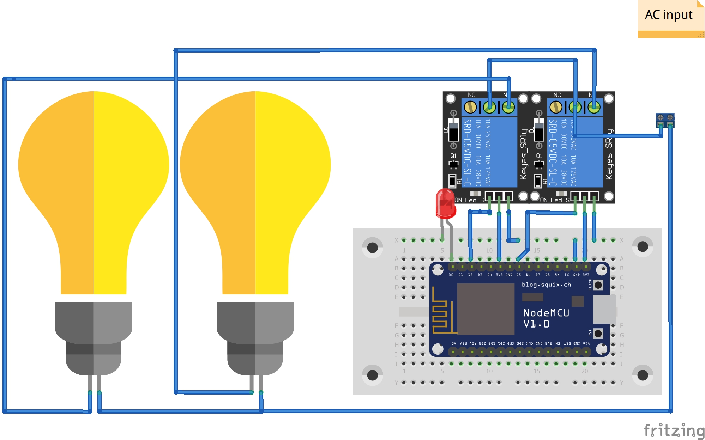

# Home_Automation_using_Sinricpro

Now you can control your devices over internet.

**Components needed**
* NodeMCU
* Relay module

Firstly setup something before use
* Put your own WIFI credentials.
* Create a account on [Sinric Pro.](https://sinric.pro/)
* Set up devices in Sinric Pro.
* Paste the APP_KEY, APP_SECRET, DEVICE_ID in respective places in the macros on the top of the source code.
* Upload to NodeMCU.

Secondly setup Alexa and Google Home
* Add Sinric Pro to Google.
* Add Sinric Pro to Alexa.

Finally connect all the components.

## Here is a breadboard prototype diagram ##

### You are good to go ###
